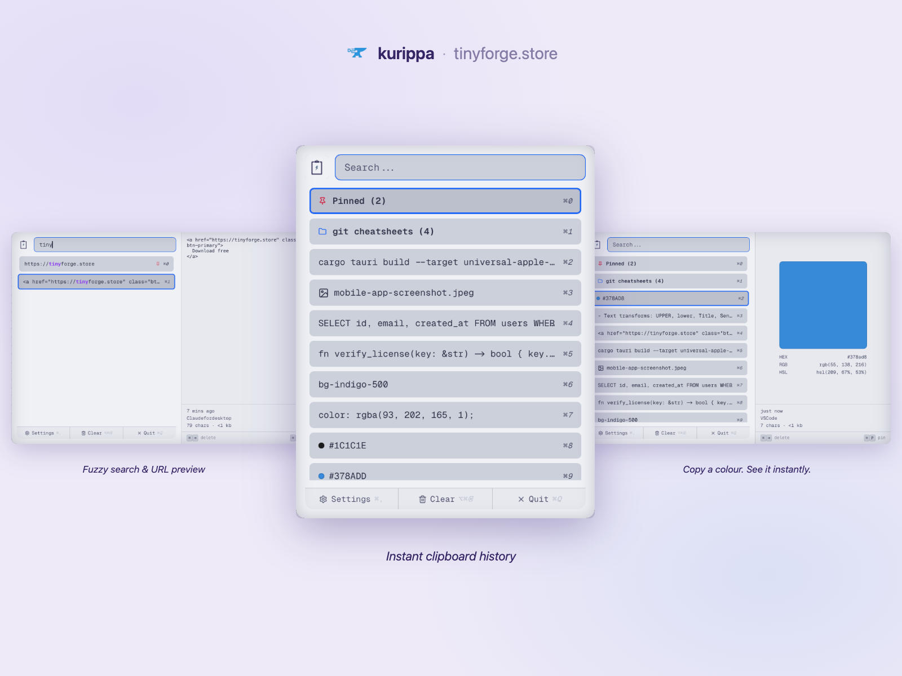

  
  <h1>Kurippa</h1>

  
  
  

  **Clipboard history, engineered for keyboard workflows.**

  
  &nbsp;
  

    
  

---

## About

Kurippa is a fast, local-first clipboard manager built for developers and keyboard-driven workflows. Hit the hotkey, type to filter, press a number to paste — no mouse required. It captures everything you copy, stores it persistently across reboots, and keeps your data entirely on-device: no cloud, no accounts, no telemetry.

Copy a hex colour and see the swatch. Copy an image and see a thumbnail. Paste HTML, wrap it in a code block, or extract a QR code — all without leaving the keyboard.

## Features

| Feature | Free trial | Paid |
|---|:---:|:---:|
| Clipboard history | Last 15 items | Up to configured limit |
| Fuzzy search | ✓ | ✓ |
| Pin items | ✓ | ✓ |
| Paste As menu (plain text, code block, case transforms…) | ✓ | ✓ |
| Keyboard shortcuts (⌘1–⌘9 / Ctrl+1–9) | ✓ | ✓ |
| Preview panel | ✓ | ✓ |
| Colour swatch preview | ✓ | ✓ |
| Text transforms | ✓ | ✓ |
| Multi-paste / merge | — | ✓ |
| Folder organisation | — | ✓ |
| QR code extraction | — | ✓ |

## Open Core

The source code is released under GPLv3. Pre-built binaries are sold on the TinyForge store — buying a license supports continued development and unlocks the full history limit and pro features.

## License

Distributed under GPLv3. See `LICENSE` for more information.

---

Kurippa by <a href="https://tinyforge.store">Tiny Forge</a> · tinyforge.store

